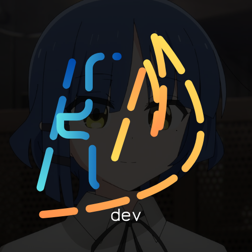

[](https://kmdev-cmd.github.io/)


---
<div align="center">

## :book: 𝚂𝚘𝚋𝚛𝚎 𝙼𝚒𝚖
- 🖥 𝙳𝚎𝚜𝚎𝚗𝚟𝚘𝚕𝚟𝚎𝚍𝚘𝚛 𝚏𝚘𝚌𝚊𝚍𝚘 𝚎𝚖 **𝙿𝚢𝚝𝚑𝚘𝚗** 𝚎 **𝚊𝚞𝚝𝚘𝚖𝚊çã𝚘**
- 💼 𝙴𝚜𝚝𝚞𝚍𝚊𝚗𝚝𝚎 𝚍𝚎 𝙳𝚎𝚜𝚎𝚗𝚟𝚘𝚕𝚟𝚒𝚖𝚎𝚗𝚝𝚘 𝚍𝚎 𝚂𝚘𝚏𝚝𝚠𝚊𝚛𝚎
- 🎓 𝙲𝚞𝚛𝚜𝚊𝚗𝚍𝚘 𝚘 𝟸º 𝚊𝚗𝚘 𝚍𝚘 𝚎𝚗𝚜𝚒𝚗𝚘 𝚖é𝚍𝚒𝚘
- 🌐 𝙿𝚛𝚘𝚓𝚎𝚝𝚘𝚜 𝚘𝚙𝚎𝚗-𝚜𝚘𝚞𝚛𝚌𝚎 𝚗𝚘 𝙶𝚒𝚝𝙷𝚞𝚋
- 𝚋𝚝𝚠 𝙴𝚞 𝚞𝚜𝚘 𝙻𝚒𝚗𝚞𝚡 [](https://archlinux.org/)

</div>

---
<div align="center">

## ⬆ 𝙾 𝚚𝚞𝚎 𝚎𝚞 𝚎𝚜𝚝𝚘𝚞 𝚏𝚊𝚣𝚎𝚗𝚍𝚘
- 🔨 𝙴𝚜𝚝𝚘𝚞 𝚌𝚞𝚛𝚛𝚎𝚗𝚝𝚎𝚖𝚎𝚗𝚝𝚎...
```yaml
- Desenvolvendo projetos Python e web
- Estudando Flask e backend
- Criando ferramentas de automação
```
- 🤞 𝚄𝚖 𝚍𝚒𝚊 𝚎𝚞 𝚎𝚜𝚙𝚎𝚛𝚘...
	- Contribuir para projetos open-source
  	- Aprender mais sobre IA e machine learning

</div>

---
<div align="center">

## Tecnologias


</div>

---
<div align="center">

## Estatísticas GitHub


</div>

---
<div align="center">

## 🔔 𝙰𝚝𝚒𝚟𝚒𝚍𝚊𝚍𝚎 𝚁𝚎𝚌𝚎𝚗𝚝𝚎 𝚗𝚘 𝙶𝚒𝚝𝙷𝚞𝚋
<!--START_SECTION:activity-->
<!--END_SECTION:activity-->

</div>

---
<div align="center">

## Especialidades
🐍 **Automação** - Scripts Python para automação de tarefas e manipulação de arquivos  
⚡ **Web Apps** - Interfaces rápidas e minimalistas com foco em performance e UX  
🛠️ **Scraping** - Extração de dados e integração com APIs para ferramentas utilitárias

</div>

---
<div align="center">

## Projetos em Destaque

<a href="https://kmdev-cmd.github.io/PDF/">
  
</a>
<br><br>
<a href="https://github.com/kmdev-cmd/Serpentia">
  
</a>
<br><br>
<a href="https://github.com/kmdev-cmd/NovaNotes">
  
</a>
<br><br>
<a href="https://github.com/kmdev-cmd/Task-Tracker-CLI">
  
</a>
<br><br>
<a href="https://km-shortener.netlify.app/">
  
</a>

</div>

---
<div align="center">

## Certificações
🎓 **Python Developer** - Sololearn (2026)  
💻 **Web Development** - Desenvolvimento web completo (2026)  
🗄️ **Banco de Dados** - SQL e PostgreSQL (2024)

</div>

---
<div align="center">

## Atualmente estudando
- Flask & Backend Web
- JavaScript avançado
- Clean Code, arquitetura e boas práticas

</div>

---
<div align="center">

## Contato

[](mailto:kmdev.cmd@gmail.com)
[](https://www.linkedin.com/in/kau%C3%AA-leandro-farias-monteiro-80a9a13a2/)
[](https://wa.me/5513974140538)
[](https://discordapp.com/users/586608984560238595)

<br><br>

[Portfólio completo 🌐](https://kmdev-cmd.github.io/)

</div>

---
<div align="center">

## ⚡ 𝙲𝚘𝚒𝚜𝚊𝚜 𝚌𝚘𝚘𝚕 𝚚𝚞𝚎 𝚏𝚘𝚛𝚊𝚖 𝚞𝚜𝚊𝚍𝚊𝚜 𝚗𝚎𝚜𝚝𝚎 𝚁𝙴𝙰𝙳𝙼𝙴
- 𝙿𝚎𝚛𝚏𝚒𝚕 𝚟𝚒𝚜𝚒𝚝 𝚌𝚘𝚞𝚗𝚝 𝚏𝚛𝚘𝚖 [𝚑𝚝𝚝𝚙𝚜://𝚐𝚒𝚝𝚑𝚞𝚋.𝚌𝚘𝚖/𝙽𝚊𝚝𝚑𝚊𝚗𝟷𝟹𝟾𝟾𝟾/𝚅𝚒𝚜𝚒𝚝𝚘𝚛𝙱𝚊𝚍𝚐𝚎𝚁𝚎𝚕𝚘𝚊𝚍𝚎𝚍](https://github.com/Nathan13888/VisitorBadgeReloaded)
- 𝙶𝚒𝚝𝙷𝚞𝚋 𝚊𝚌𝚝𝚒𝚟𝚒𝚝𝚢 𝚊𝚌𝚝𝚒𝚘𝚗 𝚏𝚛𝚘𝚖 [𝚑𝚝𝚝𝚙𝚜://𝚐𝚒𝚝𝚑𝚞𝚋.𝚌𝚘𝚖/𝚓𝚊𝚖𝚎𝚜𝚐𝚎𝚘𝚛𝚐𝚎00𝟽/𝚐𝚒𝚝𝚑𝚞𝚋-𝚊𝚌𝚝𝚒𝚟𝚒𝚝𝚢-𝚛𝚎𝚊𝚍𝚖𝚎](https://github.com/jamesgeorge007/github-activity-readme)
- 𝙶𝚒𝚝𝙷𝚞𝚋 𝙼𝚎𝚝𝚛𝚒𝚌𝚜 𝚏𝚛𝚘𝚖 [𝚑𝚝𝚝𝚙𝚜://𝚐𝚒𝚝𝚑𝚞𝚋.𝚌𝚘𝚖/𝚕𝚘𝚠𝚕𝚒𝚐𝚑𝚝𝚎𝚛/𝚖𝚎𝚝𝚛𝚒𝚌𝚜](https://github.com/lowlighter/metrics)
- 𝚂𝚔𝚒𝚕𝚕 𝚒𝚌𝚘𝚗𝚜 𝚏𝚛𝚘𝚖 [𝚑𝚝𝚝𝚙𝚜://𝚜𝚔𝚒𝚕𝚕𝚒𝚌𝚘𝚗𝚜.𝚍𝚎𝚟](https://skillicons.dev/)
- 𝙼𝚘𝚗𝚘𝚜𝚙𝚊𝚌𝚎𝚍 𝚝𝚎𝚡𝚝 𝚏𝚛𝚘𝚖 [𝚑𝚝𝚝𝚙𝚜://𝚢𝚊𝚢𝚝𝚎𝚡𝚝.𝚌𝚘𝚖/𝚖𝚘𝚗𝚘𝚜𝚙𝚊𝚌𝚎/](https://yaytext.com/monospace/)

</div>


<div align="center" style="font-size: 0.8rem; color: #666; margin-top: 20px;">
  Personagem <strong>Ryo Yamada</strong> por <strong>Bocchi the Rock</strong> © 2022 Kessoku Band
</div>
